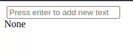

# MultiTextInput

`multi-text-input` is a Dash component library. Its only component is called `MultiTextInput` and allows you to easily create custom lists of strings with a simple interface and delete some elements from that list. The Github repository is available [here](https://github.com/pauldechorgnat/multi-text-input/).

<center></center>



## Usage

This component is available as as [Python library](https://pypi.org/project/multi-text-input/0.0.1/).

You can install it by running: 

```sh
pip install multi-text-input
```

The following shows a simple application of this 

```python
from dash import Dash, dcc, html, Input, Output, State
from multi_text_input import MultiTextInput

app = Dash(__name__)

app.layout = html.Div(
    [
        MultiTextInput(id="input"),
        html.Div(id="output"),
    ]
)


@app.callback(
    Output("output", "children"),
    Input("input", "values"),
)
def update_output(input1):
    print(input1)
    return str(input1)

if __name__ == "__main__":
    app.run(debug=True)
```

## Properties

`MultiTextInput` constructor can take: 

- `placeholder`: to change the placeholder value
- `value`: to change the starting value inside the text input
- `values`: to change the validated values (the buttons)
- `id` and `label`

Buttons are from the `multi-text-input-item` class if you want to change their design.

For callbacks, you can access the `value` and `values` properties of `MultiTextInput`:

- `value` is the actual value in the text input
- `values` is all the values of the list


_The following is auto-generated by **cookiecutter**._

## 

Get started with:
1. Install Dash and its dependencies: https://dash.plotly.com/installation
2. Run `python usage.py`
3. Visit http://localhost:8050 in your web browser

## Contributing

See [CONTRIBUTING.md](./CONTRIBUTING.md)

### Install dependencies

If you have selected install_dependencies during the prompt, you can skip this part.

1. Install npm packages
    ```
    $ npm install
    ```
2. Create a virtual env and activate.
    ```
    $ virtualenv venv
    $ . venv/bin/activate
    ```
    _Note: venv\Scripts\activate for windows_

3. Install python packages required to build components.
    ```
    $ pip install -r requirements.txt
    ```
4. Install the python packages for testing (optional)
    ```
    $ pip install -r tests/requirements.txt
    ```

### Write your component code in `src/lib/components/MultiTextInput.react.js`.

- The demo app is in `src/demo` and you will import your example component code into your demo app.
- Test your code in a Python environment:
    1. Build your code
        ```
        $ npm run build
        ```
    2. Run and modify the `usage.py` sample dash app:
        ```
        $ python usage.py
        ```
- Write tests for your component.
    - A sample test is available in `tests/test_usage.py`, it will load `usage.py` and you can then automate interactions with selenium.
    - Run the tests with `$ pytest tests`.
    - The Dash team uses these types of integration tests extensively. Browse the Dash component code on GitHub for more examples of testing (e.g. https://github.com/plotly/dash-core-components)
- Add custom styles to your component by putting your custom CSS files into your distribution folder (`multi_text_input`).
    - Make sure that they are referenced in `MANIFEST.in` so that they get properly included when you're ready to publish your component.
    - Make sure the stylesheets are added to the `_css_dist` dict in `multi_text_input/__init__.py` so dash will serve them automatically when the component suite is requested.
- [Review your code](./review_checklist.md)

### Create a production build and publish:

1. Build your code:
    ```
    $ npm run build
    ```
2. Create a Python distribution
    ```
    $ python setup.py sdist bdist_wheel
    ```
    This will create source and wheel distribution in the generated the `dist/` folder.
    See [PyPA](https://packaging.python.org/guides/distributing-packages-using-setuptools/#packaging-your-project)
    for more information.

3. Test your tarball by copying it into a new environment and installing it locally:
    ```
    $ pip install multi_text_input-0.0.1.tar.gz
    ```

4. If it works, then you can publish the component to NPM and PyPI:
    1. Publish on PyPI
        ```
        $ twine upload dist/*
        ```
    2. Cleanup the dist folder (optional)
        ```
        $ rm -rf dist
        ```
    3. Publish on NPM (Optional if chosen False in `publish_on_npm`)
        ```
        $ npm publish
        ```
        _Publishing your component to NPM will make the JavaScript bundles available on the unpkg CDN. By default, Dash serves the component library's CSS and JS locally, but if you choose to publish the package to NPM you can set `serve_locally` to `False` and you may see faster load times._

5. Share your component with the community! https://community.plotly.com/c/dash
    1. Publish this repository to GitHub
    2. Tag your GitHub repository with the plotly-dash tag so that it appears here: https://github.com/topics/plotly-dash
    3. Create a post in the Dash community forum: https://community.plotly.com/c/dash
